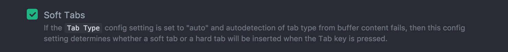
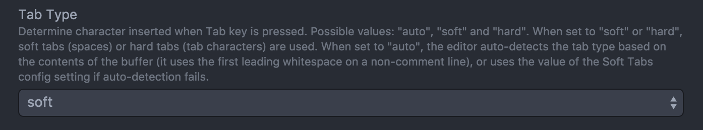

# Mini-guía para la supervivencia en Python

## Editor
Como Python no utiliza llaves, sino indentación o sangría
es importante configurar el editor para usar espacios
en vez de tabuladores. En [Atom](http://atom.io) desde
la configuración se debe utilizar:




## Scripting
Python no se compila. El prgorama python recibe
archivos de texto. Si un archivo con permisos
de ejecución (ej: `chmod 755 main.py`) tiene como primer línea
`#!/usr/bin/env python` o `#!/usr/bin/python` no
hace falta hacer `python main.py` sino simplemente
`./main.py`.

## Función main
No hay main. Se puede emular con la estructura:
```python
if __name__ == "__main__":
  print("Hola mundo")
```

## Variables
Las variables no se les da tipo y son automáticas, con solo definirlas es suficiente.
Por ejemplo en C:
```c
char cadena[] = "Cadena";
int x = 5;
int *puntero = NULL;
```
Se convierte a:

```python
cadena = "cadena"
x = 5
puntero = None # No tiene sentido en Python
```
## Cadenas

Las cadenas pueden usar las `"comillas dobles"` como `'las simples'`.
Si se usan triples se pueden extender por varias líneas.

Las cadenas se pueden componer de manera similar a `sprintf`:
```python
nombre = 'Pepe'
apellido = 'Grillo'
edad = 15

frase = 'Soy %s %s y tengo %d años' % (nombre, apellido, edad)
```
## Arreglos y Mapas

Los arreglos se definen como `arreglo = []` y son de
tamaño dinámico.
```python
arreglo.append(1)
arreglo.append("dos")
print(len(arreglo))
print (arreglo[0], arreglo[1])
```

Los mapas, o asociaciones clave-valor, se llaman diccionario en Python:
```python
a = {} # es lo mismo que a = dict()
a['nomnbre'] = 'Pepe Grillo'
a['edad'] = 18
a['resiste_pisadas'] = False
# Pero también podemos usar claves enteras
a[1] = "Arreglo"
a[2] = "Disperso"
```

## Estructuras de control

### Bloques
*En vez de utilizar las típicas llaves {}* los
bloques empiezan con `:` y se delimitan por indentación.

## if
Supongamos el siguiente código en C:
```c
int a = 1, b;
if (a > 1) {
  printf("a es mayor que 1");
  b = a;
}
```
se convierte a:
```python
a = 1
b = None
if a > 1:
  print("a es mayor que 1")
  b = a
```

## for
El for al igual que en bash, recorre colecciones.
```python
lista = ['lista', 'de', 'cosas']
for elemento in lista:
  print("elemento = %s" % elemento)
```
Para realizar un for numérico:
```python
for i in range(10):
  print("i = %d" % i)
```
## while
```c
while (1) {
  printf("Bucle infinitooooo");
  usleep(500000);
}
```
El equivalente sería:
```python
import time # Para el sleep

while True:
  print("Bucle infinitooooo")
  sleep(0.5)
```

## Funciones

Una función en C como:

```c
int funcion(char *nombre) {
  printf("Hola %s", nombre);
  return strlen(nombre);
}
```
Se traduciría a:

```python
def funcion(nombre):
  print("Hola %s" % nombre)
  return len(nombre)
```

## Clases y Objetos
C no tiene clases, así que no hay un equivalente directo.

Una clase en Python se define con `class`:

```python
from threading import Thread
from subprocess import call
class MiHilo(Thread):
  def __init__(self, programa, shell=False):
    Thread.__init__(self) # Superconstructor
    self.programa = programa
    self.shell = shell
  def run(self):
    call(self.programa, shell=self.shell)
# Creando una instancia
h = MiHilo('find ./ -iname "*.c" | grep kernel', shell=True)
h.start()
h.join()
```
Los atributos nombre y apellido se asinganan en el constructor
que debe tener el nombre `__init__`.

### `self`
Todos los métodos de instancia, en Python, reciben el parámetro
self de manera expícita. Es equivalente a `this` de C++/Java/C#.

Python rellena este atributo cuando el método es invocado.
